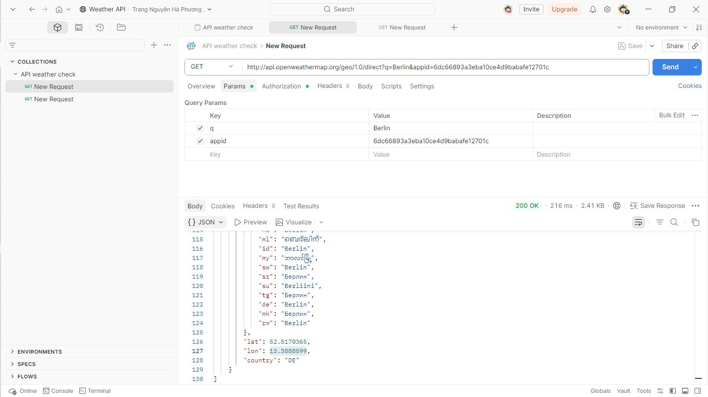
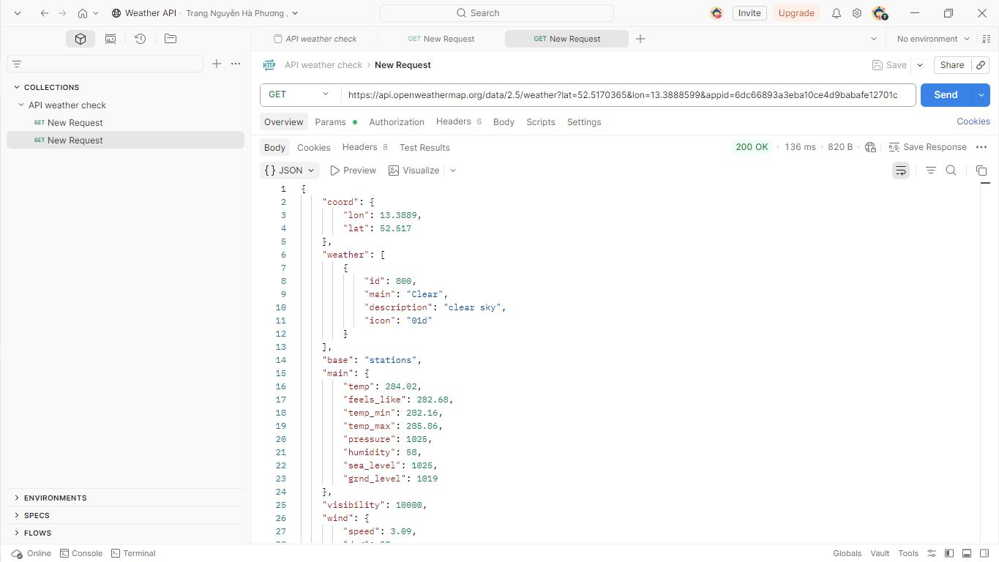
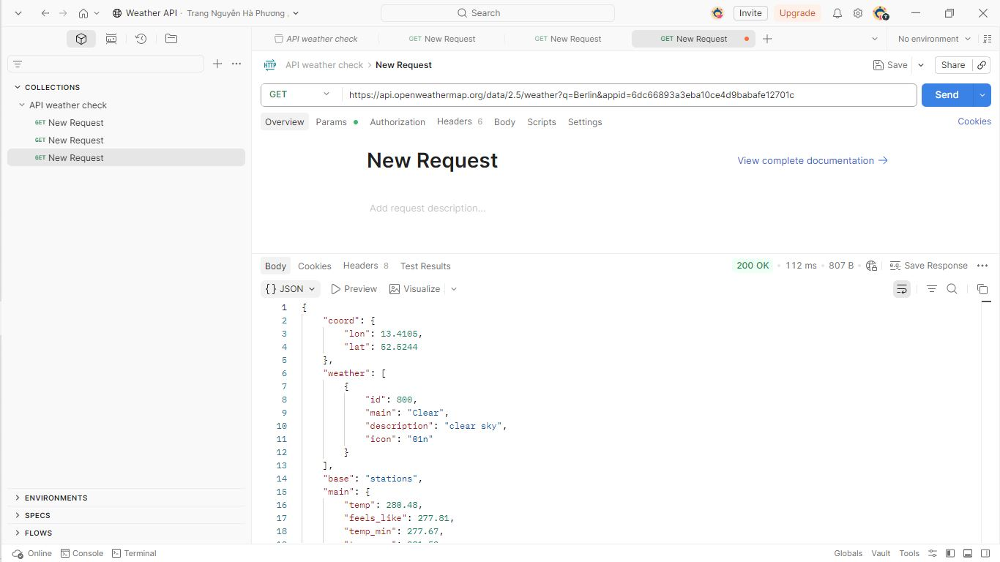

# Connected_OpenWeather_API_WeatherApp
I connected with OpenWeather to complete Weather app in Python.
*Primary tool : python, postman* 

# Project Background
A project developed for self-learning about RESTapi in HTTP protocol. Making connected with the weather API of the openWeather to create a weather app getting weather data.

## Check openWeather API with Postman

  

This api returns geographic location information of a specific city

  

This api returns weather information of a specific lat and lon information

However, to make convenient while using app just typing a city name I use api following:

  

